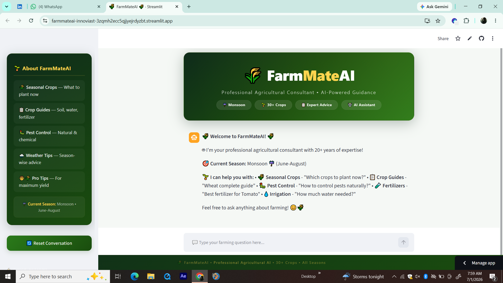
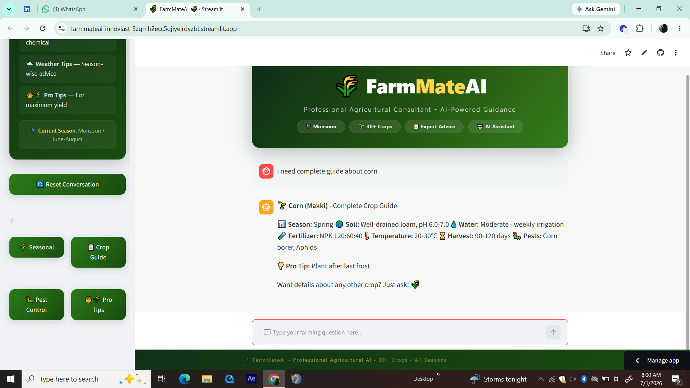
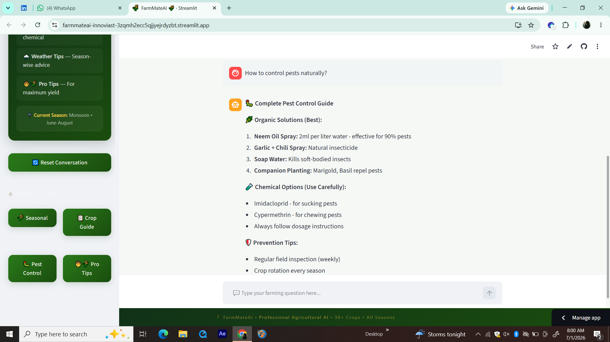

# 🌾 FarmMateAI

> **AI-Powered Agricultural Assistant for Farmers**

FarmMateAI is an intelligent chatbot that helps farmers with **crop recommendations**, **pest control**, **seasonal farming tips**, and **complete crop guides**. It's built using Python, Streamlit, and the Groq API.

---

| Homepage | Crop Guide | Pest Control |
|----------|------------|--------------|
|  |  |  |
---

## 🎯 Features

| Feature | Description |
|---------|-------------|
| 🌾 **Crop Recommendations** | Tells you which crops to plant based on the current season |
| 📋 **Complete Crop Guides** | Detailed info on soil, water, fertilizer, temperature, harvest time, and pests for 30+ crops |
| 🐛 **Pest Control Advice** | Natural (organic) and chemical pest control solutions |
| 🌧️ **Seasonal Weather Tips** | Farming advice based on current season (Winter, Spring, Monsoon, Autumn) |
| 🧑‍🌾 **Pro Farming Tips** | Expert advice for maximum crop yield |
| ⚡ **Quick Questions** | One-click buttons for common farming queries |
| 🤖 **AI-Powered** | Uses Groq API (Mixtral-8x7b) for intelligent responses |
| 🔄 **Smart Fallback** | Responds with predefined crop data even when the AI API is unavailable |
| 📱 **Responsive UI** | Works on desktop, tablet, and mobile |

---

## 🛠️ Tech Stack

| Technology | Purpose |
|------------|---------|
| **Python 3.13** | Backend logic and programming |
| **Streamlit** | Frontend UI framework |
| **Groq API** | AI model (Mixtral-8x7b-32768) |
| **JSON** | Crop database storage |
| **Git/GitHub** | Version control |
| **Streamlit Cloud** | Deployment platform |

---

## 📁 Project Structure
FarmMateAI/
├── app.py # Main application
├── requirements.txt # Python dependencies
├── .env # API keys (gitignored)
├── .gitignore # Files to ignore
├── README.md # Project documentation
├── AI_USAGE.md # AI usage documentation
├── screenshots/ # Screenshots folder
└── crops.json # Crop database (30+ crops)


---

## 🚀 Live Demo

**Deployed on Streamlit Cloud:**  
👉 (https://farmmateai-innoviast-3zqmh2ecc5qjjyejrdyzbt.streamlit.app/)

---

## 💻 Installation & Setup

### Prerequisites
- Python 3.10 or higher
- Groq API key (free) — get it from [console.groq.com](https://console.groq.com)
- Git (optional)

### Step 1: Clone the Repository

```bash
git clone https://github.com/Tooba210/FarmMateAI.git
cd FarmMateAI

Step 2: Create Virtual Environment

# Windows
python -m venv venv
venv\Scripts\activate

# Mac/Linux
python3 -m venv venv
source venv/bin/activate

Step 3: Install Dependencies
pip install -r requirements.txt

Step 4: Set Up Environment Variables

Create a .env file in the root directory and add your Groq API key:
GROQ_API_KEY=your_groq_api_key_here

Step 5: Run the Application
streamlit run app.py

The app will open at: http://localhost:8501


🌱 Supported Crops
FarmMateAI has a database of 30+ crops, including:

Season	Crops
Winter	Wheat, Onion, Potato, Garlic, Carrot
Spring	Corn, Sugarcane
Monsoon	Rice, Sugarcane
Summer	Cotton, Tomato, Cucumber, Eggplant, Okra, Mango
Year-round	Tomato, Sugarcane, Mango
📋 How to Use
In-Scope Questions (Bot Will Answer)
Category	Example Questions
🌾 Crops	"Which crops should I plant this season?"
📋 Crop Guides	"Wheat complete guide"
🐛 Pest Control	"How to control pests naturally?"
🧪 Fertilizers	"NPK ratio for Tomato"
💧 Irrigation	"How much water does rice need?"
Out-of-Scope (Bot Will Politely Decline)
❌ Non-farming topics

❌ Weather forecasts

❌ Personal or financial advice

❌ Career counseling

🔧 Troubleshooting
Issue	              Solution
ModuleNotFoundError	  Run pip install -r requirements.txt
API                   Key error	Check .env file has correct Groq API key
App                   not deploying	Check Streamlit Cloud secrets
Port                  already in use Kill existing streamlit process or use different port
                     🚢 Deployment
Deploy               on Streamlit Cloud (FREE)
Push                  your code to GitHub


🤝 Contributing
This project is part of my internship at Innoviast. Suggestions and feedback are welcome!

📄 License
This project is for educational purposes as part of the Innoviast Internship Program.

🙏 Acknowledgments
Innoviast — For the internship opportunity

Groq — For the free AI API

Streamlit — For the amazing UI framework

👩‍💻 Author
Tooba Rehman
AI Chatbot Developer Intern
Innoviast

🔗 GitHub: Tooba210
🔗 Live Demo: FarmMateAI
🔗 LinkedIn: Tooba Rehman

📊 Project Status
✅ Week 1 Complete — Foundation built, deployed, and documented
⏳ Future Plans: Multi-language support, image upload for disease detection, real-time weather API integration

⭐ Show Your Support
If you found this project helpful, please ⭐ star the repository on GitHub!

Built with ❤️ for farmers and agriculture enthusiasts.

FarmMateAI — Your AI-Powered Farming Companion 🌾


